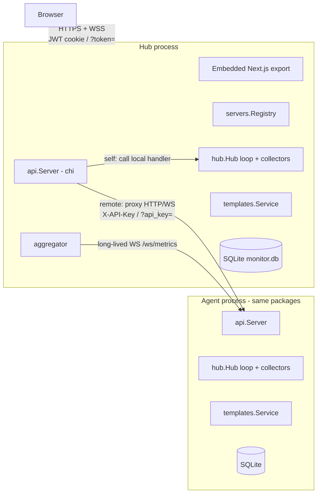

# Architecture

This document explains how Monivex (repo/module name `server-monitor`) is put together, so that developers and AI coding agents can change it safely. The [README](README.md) covers installation and usage. This file covers the code.

**How to use this doc:**
- §1–4 give you the mental model.
- §5–8 are reference material.
- §11 has step-by-step recipes for common changes.
- §13 lists the sharp edges. Read it before you touch auth, routing, templates or the frontend router.

File paths are relative to the repo root. Go module path: `github.com/ANASDAVOODTK/server-monitor`.

---

## 1. What the system is

A single Go binary that:

1. **Samples the local host** once a second: CPU, memory, disks, network, load, NVIDIA GPU, processes, systemd units and Docker containers.
2. **Streams** those snapshots over WebSocket and **persists** a slim copy to embedded SQLite.
3. **Operates** the host: Docker start/stop/restart, container `exec` and logs, a host PTY shell, PM2 apps, and log-file tailing.
4. **Deploys Docker Compose stacks** from templates (Supabase, Qdrant, vLLM, custom compose).
5. **Serves an embedded Next.js dashboard.** In *hub* mode it also **aggregates and proxies to remote agents**, which run the same code headless.

Stack: Go 1.25, chi router, gorilla/websocket, gopsutil v4, Docker SDK, `modernc.org/sqlite` (pure Go, so `CGO_ENABLED=0`), and a Next.js 16 / React 19 / Tailwind / zustand frontend exported as static files.

---

## 2. Repository map

| Path | What lives there |
|---|---|
| [cmd/server-monitor/](cmd/server-monitor/) | Hub binary (it can also run as an agent). [main.go](cmd/server-monitor/main.go) handles boot and wiring. [embed.go](cmd/server-monitor/embed.go) embeds the UI with `go:embed all:web-out`. [pair.go](cmd/server-monitor/pair.go) is the `pair` subcommand. `web-out/` is the **committed** static UI export. |
| [cmd/server-monitor-agent/](cmd/server-monitor-agent/) | Slim agent binary: no embedded UI, no registry, no aggregator. It forces `mode: agent`. |
| [internal/api/](internal/api/) | HTTP router, REST handlers, server-scoped self/remote dispatch, HTTP reverse proxy, SPA file handler. |
| [internal/ws/](internal/ws/) | WebSocket handlers (metrics, log tail, docker exec/logs, host shell), the WS origin check and the WS reverse proxy. |
| [internal/hub/](internal/hub/) | The local **sampling loop**: collect, broadcast, persist, roll up, prune. It is *not* the "hub mode" concept (see §13). |
| [internal/collectors/](internal/collectors/) | One collector per data source: gopsutil, `nvidia-smi`, the Docker SDK, and systemd over D-Bus. |
| [internal/metrics/](internal/metrics/) | The `Snapshot` wire type. It is the JSON contract with the frontend and with other hubs. |
| [internal/aggregator/](internal/aggregator/) | Hub only. Keeps a long-lived metrics WebSocket to each remote agent and tracks its connection state. |
| [internal/servers/](internal/servers/) | Hub only. The server registry: CRUD, AES-GCM encryption of agent API keys, connection test. |
| [internal/auth/](internal/auth/) | Setup token, bcrypt users, HS256 JWT cookie, API keys (sha256), and the auth middleware. |
| [internal/pairing/](internal/pairing/) | `sm://` pairing-token encoding and decoding. |
| [internal/agentboot/](internal/agentboot/), [internal/bindfix/](internal/bindfix/) | Agent first-boot pairing banner and public-URL detection. They also rewrite a loopback bind to `0.0.0.0`. |
| [internal/templates/](internal/templates/) | Template `Driver` interface, registry, lifecycle `Service`, `docker compose` CLI wrapper and port picker. Drivers live in `qdrant/`, `supabase/`, `vllm/` and `custom/`. |
| [internal/nodejs/](internal/nodejs/) | PM2 CLI wrapper. |
| [internal/store/](internal/store/) | SQLite: schema, migrations and all queries. |
| [internal/config/](internal/config/) | YAML config, defaults and the `SM_CONFIG` path resolution. |
| [web/](web/) | Next.js app. `app/` holds the pages, `components/` the shell and UI kit, and `lib/` the API client, WS client, store, types and vLLM presets. |
| [deploy/](deploy/) | systemd unit, install/uninstall scripts, Docker entrypoint. |
| [install.sh](install.sh) | `curl \| bash` bootstrap. It installs Go and Node, clones, builds, then runs `deploy/install.sh`. |
| [Makefile](Makefile), [Dockerfile](Dockerfile), `docker-compose.{hub,agent}.yml` | Build and packaging. |

---

## 3. Runtime topology

The same `internal/` packages run in three configurations:

| | Hub (`server-monitor`, `mode: hub`) | Agent (`server-monitor`, `mode: agent`) | Slim agent (`server-monitor-agent`) |
|---|---|---|---|
| Local collectors + `hub.Hub` loop | ✅ | ✅ | ✅ |
| Local REST + WS API (`/api/v1/*`, `/ws/*`) | ✅ | ✅ | ✅ |
| Templates service + reconciler | ✅ | ✅ | ✅ |
| First-run user setup banner | ✅ | ❌ (prints an `sm://` pairing token) | ❌ (pairing token) |
| Servers registry + `/api/v1/servers/*` + `/ws/servers/*` | ✅ | ❌ | ❌ |
| Aggregator | ✅ | ❌ | ❌ |
| Embedded UI | ✅ | ❌ | ❌ (not compiled in) |

The API layer switches features on nil-ness. `api.NewServer(..., registry, agg, ui)` receives `nil` for the hub-only pieces in agent mode, and [router.go](internal/api/router.go) registers the server-scoped routes only when `s.registry != nil`.



**The connection direction is always hub → agent.** Agents never dial the hub.

---

## 4. Boot sequence

[cmd/server-monitor/main.go](cmd/server-monitor/main.go):

1. If `os.Args[1]` is a bare word, dispatch a subcommand. Only `pair` exists.
2. Resolve the config path. `--config` wins, then `$SM_CONFIG`, then `./config.yaml`. `config.Load` starts from `config.Default()`, overlays the YAML, and creates `data_dir`. A missing file is **not** an error.
3. In agent mode, `bindfix.NormalizeAgentBind` rewrites a `127.0.0.1:*` or `localhost:*` bind to `0.0.0.0:*`.
4. `store.Open(data_dir)` opens `monitor.db` and runs the idempotent migrations.
5. `auth.New` loads or creates `jwt_secret` in `settings`. If there are no users, it creates an **in-memory** one-time setup token. Hub mode prints the setup banner. Agent mode runs `agentboot.PrintBootstrapPairing`, which mints an API key and prints the `sm://` token, but only if there are no API keys yet.
6. `hub.New` + `go h.Run(ctx)` start the sampling loop.
7. Build the template registry. **Register all four drivers.** The list is duplicated in both `main.go` files, so keep them in sync. Then create `templates.NewService` and start `go runTemplateReconciler` (first pass after 15 s, then every 30 s).
8. Hub mode only: `servers.New(store, jwtSecret)`, `EnsureSelf(hostname)`, `aggregator.New` + `go agg.Run`, and the UI filesystem.
9. `api.NewServer(...).Handler()` goes into `http.Server` (TLS if configured). SIGINT or SIGTERM triggers a graceful shutdown with a 10 s timeout.

[cmd/server-monitor-agent/main.go](cmd/server-monitor-agent/main.go) is the same flow with `cfg.Mode = "agent"` forced and `nil` for registry, aggregator and UI.

---

## 5. Backend packages in detail

### 5.1 `hub`: local sampling loop ([hub.go](internal/hub/hub.go))

`Hub` owns the collectors and the latest `*metrics.Snapshot`. `Run` multiplexes four tickers:

| Ticker | Interval | Work |
|---|---|---|
| sample | `metrics.sample_interval` (default 1 s) | Builds a full `Snapshot`. Processes are refreshed at most every **3 s** and systemd units every **10 s** (cached between samples). Stores it as `last` and fans it out to subscribers. |
| persist | `metrics.persist_interval` (default 10 s) | Writes a **slim** JSON copy to `metrics_short`. It has no processes, services or docker, no per-core CPU, and no GPU process lists. |
| rollup | 1 min | Copies the **latest** `metrics_short` row from the last minute into `metrics_long` at the minute boundary. It does not average. |
| prune | 5 min | Deletes rows older than `retention_short` / `retention_long`. |

Fan-out: `Subscribe()` returns a buffered channel (capacity 4) that is primed with the last snapshot. Sends are **non-blocking**, so slow consumers drop frames. Always pair a `Subscribe` with `Unsubscribe`, which closes the channel. `Hub.Docker()` exposes the Docker collector for management calls.

### 5.2 `collectors`

| Collector | Source | Notes |
|---|---|---|
| `SystemCollector` ([system.go](internal/collectors/system.go)) | gopsutil | Static host and CPU info is captured once at startup. Network rates are computed from deltas against the previous sample. Processes are the top N (`processes.top_n`). |
| `GPUCollector` ([gpu.go](internal/collectors/gpu.go)) | `nvidia-smi --query-gpu` CSV | Disabled if `nvidia-smi` isn't on PATH. **`gpu.backend` in config is currently ignored.** Only `nvidia-smi` is implemented, with no NVML. |
| `DockerCollector` ([docker.go](internal/collectors/docker.go)) | Docker Engine API over `unix://<docker.socket>` | Also provides `Start/Stop/RestartContainer` and `Client()` for exec and logs. `LastError()` surfaces socket-permission errors to the UI as `docker_error`. |
| `ServicesCollector` ([services.go](internal/collectors/services.go)) | systemd D-Bus | It disables itself permanently after the first connection failure, for example in containers or on non-systemd hosts. |

### 5.3 `api`: HTTP layer

- [router.go](internal/api/router.go) holds the route table (§7), all "local" handlers, the CORS middleware and the SPA handler.
- [servers.go](internal/api/servers.go) holds the registry CRUD handlers and the **server-scoped dispatch** (§6.2).
- [proxy.go](internal/api/proxy.go) is `proxyHTTP`, which forwards to `<base_url><path>?<same query>` with `X-API-Key`. It copies only `Content-Type`, `Accept` and `User-Agent` and strips hop-by-hop headers. Its client has `InsecureSkipVerify: true` and a 30 s timeout.
- [apikeys.go](internal/api/apikeys.go) holds the API-key CRUD and `jwtOnlyGuard`.

Handler conventions: `writeJSON(w, status, v)` / `writeErr(w, status, msg)`. The error body is always `{"error": "..."}`, and the frontend reads `err.error`. Lifecycle actions that run asynchronously return **202**.

### 5.4 `ws`: WebSocket layer ([ws.go](internal/ws/ws.go), [proxy.go](internal/ws/proxy.go), [shell_unix.go](internal/ws/shell_unix.go))

WS routes are registered **outside** the auth middleware. Every handler must call `s.checkAuth(r)` itself, which accepts an API key or a JWT. `checkOrigin` guards against cross-site WebSocket hijacking:
- An empty `Origin` (non-browser clients such as hub→agent) is allowed.
- If `server.allowed_origins` is set, only exact matches pass.
- Otherwise the origin passes if its host equals `r.Host`, is localhost, or is an IP on one of this machine's interfaces.

| Handler | Protocol |
|---|---|
| `HandleMetrics` | Server → client JSON `Snapshot` per sample, with a ping every 30 s. |
| `HandleLogs?path=` | `path` must exactly match an entry in `logs.allowed_paths` after `filepath.Abs`. Frames are `{"type":"line","line":...}` or `{"type":"error","err":...}`. Tailing starts at EOF. |
| `HandleDockerExec/{id}?shell=auto\|bash\|sh` | Binary frames carry stdin/stdout. Text frames carry JSON control messages: `{"type":"resize","cols":N,"rows":N}`. |
| `HandleDockerLogs/{id}?tail=N` | Binary frames. TTY and non-TTY containers are handled; the latter are demuxed with `stdcopy`. |
| `HandleShell` | Host PTY running `$SHELL -l` (or bash/sh) as the **service user**, with the same frame protocol as exec. On Windows it returns 501. |

`ws.Proxy` dials the upstream first, so failures still return an HTTP error. It then upgrades the client and pumps frames both ways. It **drops `token`** from the query and adds `api_key`, so the hub's JWT never reaches an agent.

### 5.5 `aggregator` ([aggregator.go](internal/aggregator/aggregator.go))

`Run` subscribes to registry mutations and reconciles one "pump" goroutine per enabled server:
- **Self:** relays `hub.Subscribe()`.
- **Remote:** dials `ws(s)://<base>/ws/metrics?api_key=…` with exponential backoff from 1 s to 60 s, pings every 20 s, a 60 s read deadline and a 2 MB read limit. A 401 or 403 becomes the error `"agent rejected the api key"`. Every received snapshot also calls `registry.SetStatus`, which is a SQLite write per remote per second.

**Current consumers:** only `StatesByID()`, used by `GET /api/v1/servers` for the fleet cards. The browser's per-server metrics socket does **not** read from the aggregator. For remotes it is a direct `ws.Proxy` to the agent, which means one upstream connection per open browser socket. `Subscribe`, `Snapshot`, `State` and `SnapshotForSelf` exist but are currently unused.

### 5.6 `servers`: registry ([registry.go](internal/servers/registry.go))

- Wraps the `servers` table. Exactly one row has `is_self=1`, enforced by a unique partial index and created by `EnsureSelf`. The self row cannot be deleted, and its `base_url` and API key are never set.
- Agent API keys are encrypted with AES-256-GCM. The key is `sha256("server-monitor.registry.v1\x00" || jwt_secret)` and the stored format is `b64(nonce):b64(ciphertext)`.
- `Subscribe(fn)` runs callbacks asynchronously after Create, Update, Delete or EnsureSelf. The aggregator uses it to reconcile.
- `TestConnection` does `GET <base>/api/v1/snapshot` with the key. A 503 ("warming up") counts as reachable.

### 5.7 `auth` ([auth.go](internal/auth/auth.go))

- **Single-admin model.** `Register` is only reachable through `/setup`, which works once per process and only while `users` is empty. Any authenticated principal has full access; there are no roles.
- JWT: HS256, 12 h lifetime, claims `{uid, usr}`. It is delivered as cookie `sm_token` with **`HttpOnly=false` on purpose**, because the frontend reads it to append `?token=` to WS URLs. The cookie is `SameSite=Lax` and `Secure` when TLS is enabled.
- Token lookup order: cookie, then `Authorization: Bearer`, then `?token=`.
- API keys: id `ak_<12 hex>`, secret `sm_<64 hex>`. Only `sha256(secret)` is stored. Keys come from the `X-API-Key` header or `?api_key=`. The resulting claims have `Username = "apikey:<id>"`, and `IsAPIKey()` checks that prefix.
- `Middleware` tries an API key first, then the JWT. `/api-keys*` routes add `jwtOnlyGuard`, so an API key cannot mint or revoke keys.

### 5.8 `templates`: Compose deployments

Two layers:

- **Driver** ([driver.go](internal/templates/driver.go)) is pure and side-effect free:
  ```go
  type Driver interface {
      Definition() Definition               // id, name, form Fields, Ports, SupportsUpdate
      Validate(input DeployInput) error
      Render(d *Deployment) (RenderedArtifacts, error) // compose, .env, extra Files (relative paths)
  }
  ```
  A driver can optionally implement `DefaultGenerator` or `PortAwareDefaultGenerator` ([defaults.go](internal/templates/defaults.go)) to pre-fill secrets and URLs for the deploy form.

  `RenderedArtifacts` has three kinds of output besides compose and `.env`:
  - `Files` are rewritten on every render.
  - `SeedFiles` are written only if missing. Use them for content the user edits afterwards, such as function sources or secret env files.
  - `Dirs` are created before compose runs, so bind-mount sources are owned by this process instead of being auto-created by Docker as root.

  Any file whose name starts with `.env` is written with mode 0600.
- **`FunctionsSupport`** ([functions.go](internal/templates/functions.go)) is an optional driver capability. The driver returns a `FunctionsLayout`: the source dir, the secrets env file, the secret-files dir and its container mount, the compose service name, and the reserved env keys. With that, `Service` provides:
  - Function source CRUD. Paths are validated and cannot escape through `..` or symlinks. Runtime entries such as `main` can't be deleted.
  - Secrets env CRUD, written as dotenv that compose reads back verbatim.
  - Secret-file upload. Contents are never returned.
  - `RestartFunctions`: re-render, `compose up`, then `up --no-deps --force-recreate <service>`. Progress is reported through events only, and the deployment status is not changed.

  Only Supabase implements it today.
- **Service** ([service.go](internal/templates/service.go)) handles persistence, the files on disk, `docker compose` (the CLI through [compose.go](internal/templates/compose.go), not the SDK), async lifecycle, the event log and the reconciler.

Drivers:

| id | Package | Extra files rendered | Notes |
|---|---|---|---|
| `supabase` | [supabase/](internal/templates/supabase/) | `volumes/kong.yml`, `volumes/db/init.sql`. Seeds: `volumes/functions/main/index.ts`, `volumes/functions/deno.jsonc`, `.env.functions` | Port-aware generator: creates the JWT secret and signs anon/service JWTs. The Edge Runtime `functions` service is on unless `functions_enabled=no`; its sources are in `volumes/functions` (shared with Studio) and its secret files in `volumes/secrets` (mounted at `/run/secrets`). Realtime is reached through the network alias `realtime-dev.supabase-realtime`, because Realtime takes the tenant from the Host header. Optional backup sidecars write to `volumes/backup/{db,files}`; the one-shot `backup-init` container chowns the dump dir first. |
| `qdrant` | [qdrant/](internal/templates/qdrant/) | `volumes/qdrant/production.yaml` | Generates the API key. |
| `vllm` | [vllm/](internal/templates/vllm/) | `Dockerfile`, only when `extra_pip_packages` is set | Shown **only** under the "LLM Models" UI tab. The Templates page filters `vllm` out. |
| `custom` | [custom/](internal/templates/custom/) | none | The user's compose and `.env` pass through verbatim. Validation requires YAML with a non-empty `services:` map. |

See §6.4 for the lifecycle.

### 5.9 `store` ([sqlite.go](internal/store/sqlite.go))

See §8. Every SQL statement in the codebase lives here, so add new queries here too.

### 5.10 `config` ([config.go](internal/config/config.go))

YAML is unmarshalled over `Default()`. Durations accept Go syntax plus a `d` suffix (`30d`). The `nodejs:` block exists in code but is absent from [config.example.yaml](config.example.yaml). `nodejs.allowed_script_prefixes` must be non-empty before the UI may `pm2 start` new scripts.

---

## 6. Core flows

### 6.1 Metrics: from collector to browser

```
collectors ──sample()──▶ hub.last ──▶ hub subscribers
                                        ├─ ws.HandleMetrics  ──▶ browser  (self)  or ──▶ hub's ws.Proxy (when this process is an agent)
                                        └─ aggregator.pumpLocal (hub only, for the fleet list)
            persist() ──▶ metrics_short ──rollup()──▶ metrics_long ──prune()
```

`GET /history?range=<Go duration>` reads `metrics_short` when range ≤ 6 h and `metrics_long` otherwise. The range goes through `time.ParseDuration`, so `720h` works but `30d` does **not**. History is always read from the SQLite of the host that collected it; for remote servers the request is proxied to the agent.

In the browser, `useMetricsSocket(serverId)` in [web/lib/ws.ts](web/lib/ws.ts) writes each frame into the zustand store in [web/lib/store.ts](web/lib/store.ts), which keeps the current snapshot plus a 120-point in-memory history per server for sparklines. It reconnects with exponential backoff capped at 30 s.

### 6.2 Multi-server dispatch (hub)

Every per-server page calls `/api/v1/servers/{serverId}/…` or `/ws/servers/{serverId}/…`. [servers.go](internal/api/servers.go) resolves the server and branches:

```
resolveServer(serverId) ─▶ registry.Get + DecryptKey   (404 if missing or disabled)
   ├─ sv.IsSelf  ─▶ call the local handler directly (withChiParam re-injects {id}/{pmId}/{templateId})
   └─ remote     ─▶ proxyHTTP(base_url + "/api/v1/<same path>", X-API-Key)
                    or ws.Proxy(base_url + "/ws/<same path>", ?api_key=)
```

The hub proxies to the agent's **un-scoped** local routes, so the agent's local API is the contract between versions. Adding or renaming a local route means the hub and its agents must be upgraded together.

### 6.3 Auth, pairing and trust

```
Agent first boot (0 API keys) ─▶ CreateAPIKey ─▶ pairing.Encode(url, secret) ─▶ prints sm://<b64url(JSON{v:1,url,key,note})>
User pastes sm://… into hub "Add server" ─▶ POST /servers {pairing} ─▶ Decode ─▶ registry.Create (encrypt key) ─▶ aggregator reconciles & dials
```

- `server-monitor pair <url>` (or `server-monitor-agent pair`) mints more keys at any time. It opens the same SQLite file, which is safe while the daemon runs because of WAL and the busy timeout.
- Hub→agent TLS verification is **disabled** in `proxyHTTP`, `ws.ProxyDialer` and the aggregator dialer, on the assumption of self-signed LAN certificates. `registry.TestConnection` uses a default `http.Client` and **does** verify, so the connection test fails against self-signed agents while the real connection works (see §13).
- CORS: `corsMiddleware` echoes any `Origin` with credentials. Cross-site protection for HTTP depends on the `SameSite=Lax` cookie; for WS it depends on `checkOrigin`.

### 6.4 Template deployment lifecycle

`POST /templates/{templateId}/deploy` → `Service.Deploy`:

1. Require a name, then `driver.Validate(input)`, then `MergeConfig`. Field and port defaults are applied first and user values override them.
2. `makeSlug(name)` (lowercase, `[a-z0-9_-]`, max 32 chars, prefixed `p-` if it doesn't start with a letter), then `ValidateSlug`, then a uniqueness check.
3. `assertPortsFree` checks the ports against **other deployments only**. The live-listener probe runs earlier, in `GenerateDefaults`.
4. Create `<storage_root>/<slug>/` and insert the row with `status=deploying` plus its env rows. Append event `deploy:start`.
5. `writeArtifacts`: `docker-compose.yml`, `.env` (mode `0600`) and the driver's `Files`. Paths are checked so writes cannot escape the workdir.
6. Return **202**. A goroutine runs `docker compose --project-name <slug> -f docker-compose.yml --env-file .env up -d --remove-orphans` (15 min timeout). The result is `running`, or `failed` with the compose output plus logs from any service reported as `didn't complete successfully`.

State machine (`Status*` constants in [types.go](internal/templates/types.go)):

```
deploy ─▶ deploying ─┬▶ running
start  ─▶ starting  ─┤
update ─▶ updating  ─┤   (update = compose pull + up; edit with restart=true = re-render + up)
                     └▶ failed
stop   ─▶ stopping  ─▶ stopped | failed
delete ─▶ deleting  ─▶ row + workdir removed | failed   (?volumes=true adds `down -v`)

reconciler (every 30 s): for rows NOT in a transitional state, `compose ps --format json --all`
   ─▶ all running ⇒ running · none running & some exited ⇒ stopped · otherwise ⇒ failed(+first problem)
   (containers labelled server-monitor.oneshot=true are ignored once they exit 0; a non-zero exit is a problem)
```

- Every async lifecycle goroutine takes **one process-wide mutex** (`Service.mu`). Operations on a host are therefore serialized, and a long vLLM image build blocks every other deployment's start or stop until it finishes.
- `Start` and `Update` re-render artifacts from the stored config before running compose, so a template-code change reaches existing deployments on their next start.
- The UI polls `GET /templates/deployments/{id}` and `/events` for progress. There is no push channel.

---

## 7. API surface

All REST routes live under `/api/v1` with a 30 s timeout middleware.

**Public:** `GET /health`, `GET /setup/status`, `POST /setup`, `POST /auth/login`, `POST /auth/logout`.

**Authenticated local routes (every mode).** The agent serves these to the hub:

| Area | Routes |
|---|---|
| Session | `GET /me`, `POST /auth/password` |
| Metrics | `GET /snapshot` (503 `warming up` before the first sample), `/processes`, `/services`, `/docker/containers`, `/history?range=`, `/logs/sources` |
| Docker | `POST /docker/containers/{id}/{start\|stop\|restart}` |
| PM2 | `GET /node-apps`, `POST /node-apps`, `POST /node-apps/{pmId}/{start\|stop\|restart\|delete}` |
| Templates | `GET /templates`, `GET /templates/{templateId}`, `GET /templates/{templateId}/defaults`, `POST /templates/{templateId}/deploy`, `GET /templates/deployments`, `GET /templates/deployments/{id}[/events\|/backups]`, `POST /templates/deployments/{id}/{start\|stop\|update\|edit\|delete}` |
| Edge Functions ([functions.go](internal/api/functions.go)) | `GET /templates/deployments/{id}/functions`, `GET\|PUT\|DELETE …/functions/file` (`?path=`, or a JSON body for PUT), `POST …/functions/restart` (202), `GET\|PUT …/secrets`, `PUT\|DELETE …/secrets/files` (upload as `content_base64`; delete with `?name=`) |
| API keys (JWT only) | `GET/POST /api-keys`, `DELETE /api-keys/{id}` |

**Hub only:** `GET/POST /servers`, `POST /servers/test`, `PUT/DELETE /servers/{id}`, plus `/servers/{serverId}/<every local route above except session and api-keys>`.

**WebSockets:** `/ws/metrics`, `/ws/logs?path=`, `/ws/docker/exec/{id}`, `/ws/docker/logs/{id}`, `/ws/shell`. The hub also serves each of them at `/ws/servers/{serverId}/…`.

**Everything else** goes to the SPA handler (§9.2), and only when a UI is embedded.

---

## 8. Persistence

### 8.1 SQLite (`{data_dir}/monitor.db`)

Opened with WAL, `busy_timeout=5000`, `foreign_keys=1` and **`SetMaxOpenConns(1)`**, so all access is serialized through one connection. The schema lives in `Store.migrate()` as a list of `CREATE … IF NOT EXISTS` statements. **There is no migration versioning.** Adding a column to an existing table needs an explicit, idempotent `ALTER TABLE` step (§11.6).

| Table | Purpose |
|---|---|
| `users` | Admin account (bcrypt). |
| `settings` | Key/value store. Holds `jwt_secret`. |
| `metrics_short`, `metrics_long` | `(ts INTEGER unix seconds, payload JSON BLOB)`, indexed on `ts`. |
| `api_keys` | Keys *this* instance accepts (sha256 hash, `last_used_at`). |
| `servers` | Hub registry. It exists on agents too but stays empty there. |
| `template_deployments` | One row per deployment. `config_json` and `ports_json` hold the resolved values; `slug` is UNIQUE. |
| `template_deployment_env` | Extra env vars per deployment (cascade delete). |
| `template_deployment_events` | Lifecycle log (cascade delete). |

### 8.2 Filesystem

| Path | Content |
|---|---|
| `{data_dir}/monitor.db*` | Database plus WAL/SHM. |
| `{templates.storage_root or data_dir/templates}/<slug>/` | `docker-compose.yml`, `.env`, and driver files. Supabase adds `.env.functions` (0600), `volumes/functions/**` (function code), `volumes/secrets/**` (0700 dir, 0600 files) and `volumes/backup/**`. |
| Docker named volumes | Deployment data, namespaced by the compose project (`<slug>`). |

Losing `jwt_secret` (for example by deleting `monitor.db`) logs everyone out, invalidates the setup state, and makes every stored agent key **undecryptable**. Each server would then have to be paired again.

---

## 9. Frontend (`web/`)

### 9.1 Build model

- In production `next build` runs with `output: 'export'` and emits static HTML/JS to `web/out/`. `make web` copies that to `cmd/server-monitor/web-out/`, and `go:embed` bakes it in. If `web-out/` holds only `.gitkeep`, `uiFromMain` returns nil and the binary is API-only.
- In dev (`npm run dev` on :3000) the export is disabled and [next.config.mjs](web/next.config.mjs) rewrites `/api/*` and `/ws/*` to `SM_BACKEND_ORIGIN` (default `http://localhost:8080`). `SM_DEV_ORIGINS` adds allowed dev origins.

### 9.2 Routing under static export (important)

- The dynamic segment `app/servers/[id]` is pre-rendered **once** with the sentinel `id = "_"` (`generateStaticParams` in [layout.tsx](web/app/servers/[id]/layout.tsx)). The Go `spaHandler` maps `/servers/<anything>/<rest>` to `servers/_/<rest>.html`.
- Because of that, **`useParams()` returns `"_"` in production. Always use `useServerId()`** from [use-server-id.ts](web/lib/use-server-id.ts), which parses `window.location.pathname`.
- Second-level identifiers can't be dynamic segments. Pass them as query strings, for example `docker/container?id=…`, `templates/deploy?template=…`, `templates/deployment?id=…`, and read them with `useSearchParams()`.

### 9.3 Structure

| Piece | Role |
|---|---|
| [components/dashboard-shell.tsx](web/components/dashboard-shell.tsx) | Auth gate: `setupStatus` → `/setup`, `me()` failure → `/login`. Opens the metrics socket for the current server. Renders the sidebar and topbar. |
| [components/sidebar.tsx](web/components/sidebar.tsx) | `NAV_TEMPLATE` lists the per-server tabs. Add new pages here. |
| [components/ui.tsx](web/components/ui.tsx), `stat-card.tsx`, `sparkline.tsx` | Shared UI kit (Tailwind; the theme is in `tailwind.config.ts` and `globals.css`). |
| [lib/api.ts](web/lib/api.ts) | The only REST client. `request()` uses `credentials: 'include'` and throws `Error(body.error)`. Per-server calls take `serverId` first and hit `/servers/{id}/…`. |
| [lib/ws.ts](web/lib/ws.ts) | `wsUrl(path)` builds a same-origin URL and appends `?token=<sm_token cookie>`. Also `useMetricsSocket` and `openLogSocket`. |
| [lib/store.ts](web/lib/store.ts) | zustand: `byServer[serverId] = {current, history, connected}`. |
| [lib/types.ts](web/lib/types.ts) | **Hand-maintained** mirror of the Go JSON types (`metrics.Snapshot`, templates types and so on). |
| [lib/vllm-presets.ts](web/lib/vllm-presets.ts) | Frontend-only vLLM model catalog. It maps to `vllm` driver fields and `extra_cli_args`. |

Pages: `/` (fleet list and add server), `/login`, `/setup`, `/settings` (password and API keys), and `/servers/[id]` with the sub-pages overview, `gpu`, `processes`, `services`, `node-apps`, `docker` (+ `docker/container`), `templates` (+ `deploy`, `deployment`), `llm` (+ `llm/deploy`), `disks`, `logs` and `terminal`. The terminals use xterm.js ([docker/terminal.tsx](web/app/servers/[id]/docker/terminal.tsx), [terminal/host-shell-terminal.tsx](web/app/servers/[id]/terminal/host-shell-terminal.tsx)).

---

## 10. Build, packaging and deployment

| Command | Result |
|---|---|
| `make build` | `make web` (npm install + build + copy to `web-out/`), then `CGO_ENABLED=0 go build -trimpath -ldflags="-s -w" -o bin/server-monitor ./cmd/server-monitor`. |
| `make backend` | Go build only. It embeds **whatever is currently in `web-out/`**. |
| `make agent` | `bin/server-monitor-agent`. |
| `sudo make install` / `install-agent` / `uninstall` | [deploy/install.sh](deploy/install.sh) creates the `server-monitor` user and puts the binary in `/opt/server-monitor`, the config in `/etc/server-monitor/config.yaml`, the data in `/var/lib/server-monitor` and installs the systemd unit. Agent installs use `mode: agent` on :8090. **These targets do not build.** |
| `make docker` | Three-stage [Dockerfile](Dockerfile): node export, Go build plus static docker CLI and compose plugin, then a debian-slim runtime. [docker-entrypoint.sh](deploy/docker-entrypoint.sh) generates the config from `SM_MODE`, `SM_BIND`, `SM_DATA_DIR`, `SM_DOCKER_SOCKET`, `SM_TEMPLATES_ROOT`, `SM_LOG_PATHS` and `SM_TLS_CERT/KEY`, **only if the config file doesn't exist**. The compose files run with `pid: host`, `network_mode: host` and `privileged`. |

The systemd unit ([server-monitor.service](deploy/server-monitor.service)) is hardened. Keep these limits in mind when adding features:
- `ProtectSystem=strict` and `ReadWritePaths=/var/lib/server-monitor`, so the service can write **only** there. That covers the templates storage root and anything else you persist.
- `ProtectHome=true` and `NoNewPrivileges=true`.
- It runs as user `server-monitor` with `SupplementaryGroups=docker`.

---

## 11. Recipes for common changes

### 11.1 Add a REST endpoint that works per server

1. Add the handler and the local route in [router.go](internal/api/router.go), inside the protected group. This makes it available on agents.
2. Mirror it in `registerServerScopedRoutes` in [servers.go](internal/api/servers.go):
   - With no path params: `r.Get("/foo", s.scoped("/api/v1/foo", s.handleFoo))`.
   - With path params: write a `scopedX` wrapper, following `scopedDocker` and `scopedDeployment`. It rebuilds the upstream path from the params, and in the self branch it calls `withChiParam(r, "<param>", value)` before the local handler.
3. Add a client function in [web/lib/api.ts](web/lib/api.ts) that uses `/servers/${enc(serverId)}/…`, and add the types in [web/lib/types.ts](web/lib/types.ts).
4. Remote servers only get the feature once their agent binary includes step 1.

### 11.2 Add a WebSocket endpoint

1. Add `HandleX` in `internal/ws`. It **must** begin with `if !s.checkAuth(r) { 401 }`, and it upgrades with the package-level `upgrader` so the origin check applies. Set write deadlines, and run a reader goroutine to detect disconnects (follow `HandleLogs`).
2. Register the local route `r.Get("/ws/x", s.ws.HandleX)` in `router.go`.
3. Add the hub-scoped handler `handleScopedWSX` in `servers.go`: self calls the local handler, remote calls `ws.Proxy(w, r, sv.BaseURL, apiKey, "/ws/x", r.URL.RawQuery)`. Register it under `if s.registry != nil`.
4. On the frontend, connect with `new WebSocket(wsUrl('/ws/servers/<id>/x'))`.
5. If it uses a Unix-only API, add a `//go:build windows` stub like [shell_windows.go](internal/ws/shell_windows.go). Developers build on Windows.

### 11.3 Add a metric to the snapshot

1. Add the field to [metrics/types.go](internal/metrics/types.go) with a snake_case JSON tag.
2. Collect it in a collector and set it in `hub.sample`. If it's expensive, cache it the way processes and services are cached.
3. If it should appear in history, add it to the `slim` struct in `hub.persist`.
4. Mirror it in [web/lib/types.ts](web/lib/types.ts). Treat it as optional, because older agents won't send it.
5. Keep the snapshot small: it is sent every second to every socket, and the aggregator's read limit is 2 MB.

### 11.4 Add a template driver

1. Create `internal/templates/<name>/` with a `Driver` implementing `Definition`, `Validate` and `Render`. Use `text/template` for compose and env as the existing drivers do. Validate env keys with the same `^[A-Za-z][A-Za-z0-9_]{0,63}$` regex. `Files` paths must be relative.
2. Optionally implement `GenerateConfig()` or `GenerateConfigWithPorts(ports)` for secrets and URL defaults.
3. Register it in **both** [cmd/server-monitor/main.go](cmd/server-monitor/main.go) and [cmd/server-monitor-agent/main.go](cmd/server-monitor-agent/main.go).
4. The generic UI in [templates/deploy/page.tsx](web/app/servers/[id]/templates/deploy/page.tsx) renders the form from `Fields` (grouped by `Group`) and `Ports`. Nothing else is required unless you want a bespoke page like `llm/`.
5. Add a `<name>_test.go` covering `Validate` and a `Render` golden check. See [qdrant_test.go](internal/templates/qdrant/qdrant_test.go).

### 11.5 Add a dashboard page

1. Create `web/app/servers/[id]/<page>/page.tsx` with `'use client'`, and get the id from `useServerId()`.
2. Add it to `NAV_TEMPLATE` in [sidebar.tsx](web/components/sidebar.tsx).
3. For sub-entities, use `?id=` query params (§9.2).
4. Live data comes from `useServerMetrics(serverId)` in [store.ts](web/lib/store.ts). There is already one metrics socket per page, so don't open another one.
5. Run `make web` so `web-out/` is regenerated. The committed copy is stale (§13).

### 11.6 Add a config option or a DB column

- **Config:** add the field to [config.go](internal/config/config.go) with a YAML tag, a default in `Default()`, a documented entry in [config.example.yaml](config.example.yaml), and entries in `docker-entrypoint.sh` and `deploy/install.sh` if containers or installers need it.
- **DB column:** because there is no migration framework, append an idempotent step to `migrate()`. For example, check `PRAGMA table_info(<table>)` before `ALTER TABLE … ADD COLUMN`. Then update the struct, the column lists (`serverCols` and the scan functions) and every `INSERT`/`SELECT` that touches the table.

---

## 12. Conventions

- **Go:** `context.Context` is the first parameter for anything that does I/O. Wrap errors with `fmt.Errorf("verb: %w", err)`. Log with `log.Printf("pkg: …")`. Doc comments explain *why*, and new code should match that density. Every SQL statement stays in `store`. Handlers stay thin and delegate to services.
- **IDs:** `srv_<16hex>` and `self_<16hex>` for servers, `ak_<12hex>` for API keys, 16 hex characters for deployments, and slugs for compose projects.
- **JSON:** snake_case tags. Errors are `{"error": "..."}`. Timestamps are RFC 3339 in snapshots and templates, and unix seconds in `servers` and `api-keys` responses.
- **Frontend:** client components only (there is no server runtime in production). Use the `@/` path alias. Build classes with Tailwind plus `cn()`/`clsx`. Icons come from `lucide-react`.
- **Tests:** table-driven Go tests next to the code. Only `store`, `templates/*` and `api` have tests today. [api/functions_test.go](internal/api/functions_test.go) shows how to drive a real `api.Server` through `httptest`, including the hub's server-scoped dispatch.

---

## 13. Invariants, sharp edges and known issues

**Invariants to preserve**
- Don't forward the hub JWT to agents. `ws.Proxy` strips `token`, and `proxyHTTP` copies only allowlisted headers.
- WS handlers authenticate themselves, because they sit outside the auth middleware.
- Log tailing is limited to the exact paths in `logs.allowed_paths`. Template writes must stay inside `<storage_root>/<slug>/`.
- API keys can't manage API keys (`jwtOnlyGuard`).
- The self server has no base URL and no key, and it can't be deleted.
- `metrics.Snapshot` JSON is a cross-version wire contract between hubs and agents. Add fields; don't rename or remove them.

**Naming traps**
- `internal/hub` is the **sampling loop** and runs in every mode. "Hub mode" is `cfg.Mode != "agent"`.
- The product is "Monivex", but the binary, systemd unit, user, paths and module are all `server-monitor`.
- `templates.Service` is created in every mode. Agents must serve the template routes for hub proxying to work.

**Sharp edges**
- The committed `cmd/server-monitor/web-out/` is an **old build**: it has no `llm/` or `terminal/` pages. `make backend` embeds it as-is. Run `make web` (or `make build`) to get a current UI.
- `go test ./...` also walks `web/node_modules`. It's harmless, but `go test ./internal/... ./cmd/...` is cleaner.
- The setup token is kept in memory and regenerated on every restart until the first user exists.
- `history?range=` does not accept `d` units.
- `gpu.backend` has no effect; only `nvidia-smi` is used.
- Deploy-time port checks cover other deployments only. Live-port probing happens only in `GET …/defaults`.
- `templates.Service.mu` serializes every lifecycle operation on a host (§6.4).
- The aggregator writes `servers.last_ok_at` to SQLite on every snapshot from every remote agent.
- Unused code you can ignore or remove: `auth.JWTOnlyMiddleware`, `store.LatestShort`, and `aggregator.Subscribe/Snapshot/State/SnapshotForSelf`.

**Template containers and file ownership**
- The service runs as the unprivileged `server-monitor` user, so a driver must never need `sudo` on the host.
- Create bind-mount sources through `RenderedArtifacts.Dirs`.
- When a container's non-root user must write to a host dir, add a one-shot init container that runs as root and chowns it. Label it `server-monitor.oneshot: "true"` so the reconciler ignores it once it exits, and make the real service `depends_on` it with `service_completed_successfully`. Supabase's `backup-init` is the example to copy.

**Known bugs (verified by reading the code, not fixed)**
- **"Test connection" fails against self-signed agents.** `servers.Registry.TestConnection` uses a TLS-verifying `http.Client`, while the real proxy and aggregator connections skip verification.

---

## 14. Verifying a change

```bash
# Backend
go build ./... && go vet ./... && go test ./internal/... ./cmd/...

# Frontend
cd web && npx tsc --noEmit && npm run lint && npm run build

# Run locally: hub + agent on one machine
go run ./cmd/server-monitor --config ./config.example.yaml           # hub on :8080, prints setup token
cd web && npm run dev                                                # UI on :3000 with hot reload
# second terminal: agent with its own data dir
printf 'mode: agent\nserver:\n  bind: "0.0.0.0:8090"\ndata_dir: "./data-agent"\n' > config.agent.yaml
go run ./cmd/server-monitor --config ./config.agent.yaml             # prints sm://… token, paste into hub
```

Some behaviour needs a real Linux host: systemd units, PTY shell, D-Bus, `/proc`-heavy process data, and Docker over the unix socket. On Windows:
- The services collector disables itself.
- `/ws/shell` returns 501.
- Docker is dialed through a hard-coded `unix://` socket, so Docker features are normally unavailable.
