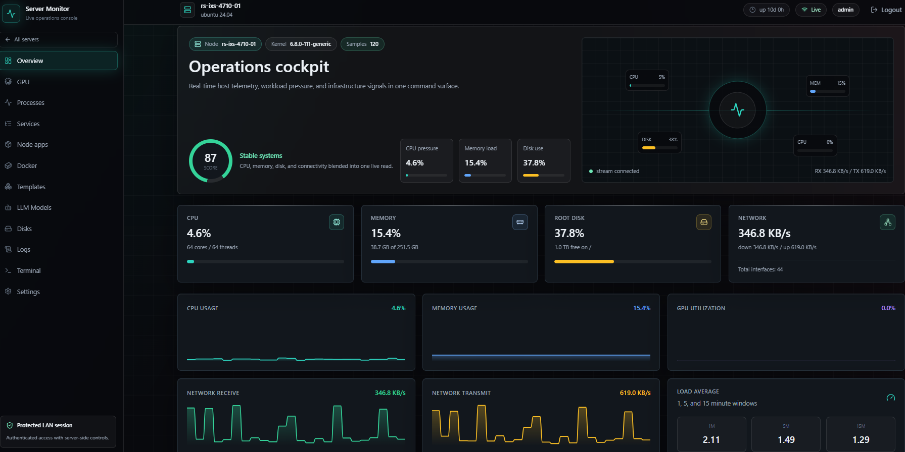
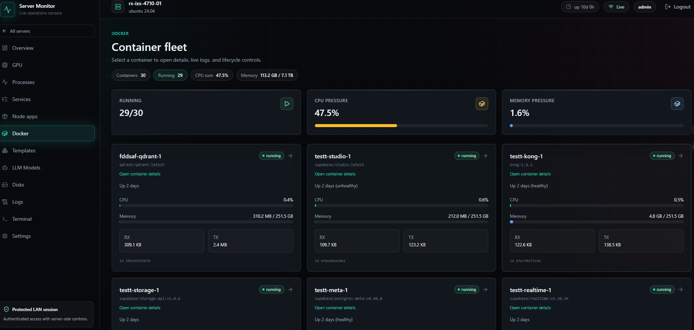
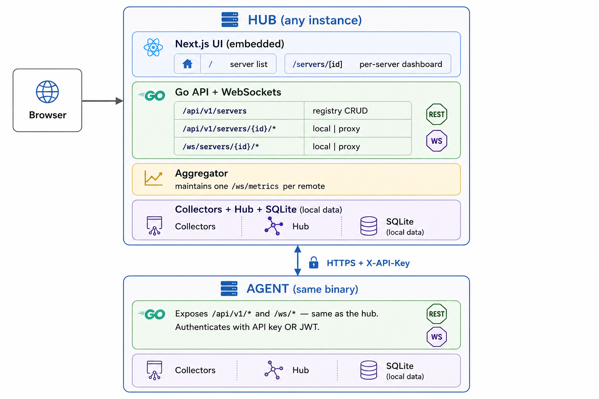
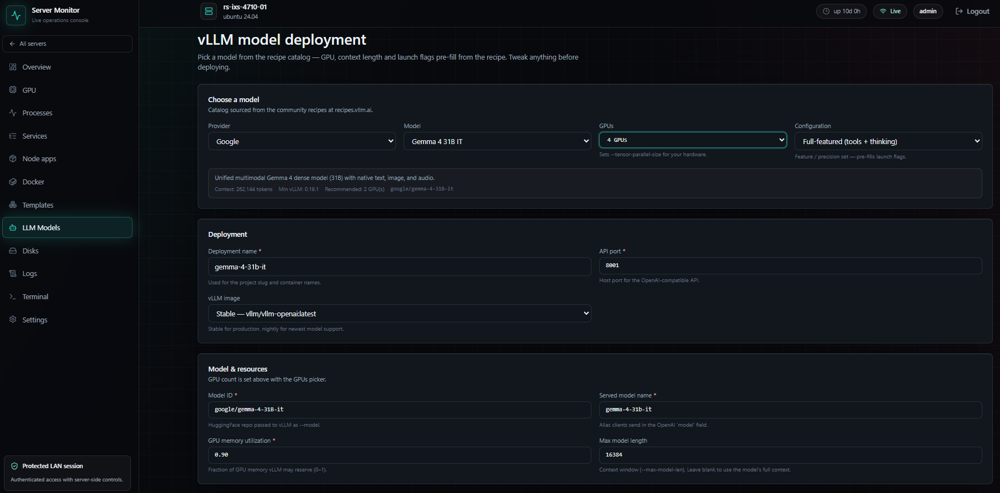

# Monivex

**Self-hosted fleet monitoring, Docker control, and one-click app + LLM deployment — in a single Go binary.**

[](https://hub.docker.com/r/anasdavoodtk/monivex)
[](https://hub.docker.com/r/anasdavoodtk/monivex)
[](LICENSE)
[](https://github.com/ANASDAVOODTK/monivex)


Monivex is one Go binary that embeds a Next.js dashboard. It collects local metrics (CPU, RAM, disk, network, NVIDIA GPU, processes, systemd services, Docker), tails log files, deploys containerized apps and LLMs, and exposes everything over HTTP/WebSocket with SQLite for history.

Run the same binary on every machine you want to monitor. Designate one instance as the **hub** — from its dashboard you add the others as remote servers and watch the whole fleet on one screen.

<p align="center">
  
</p>

---

## Contents

- [Highlights](#highlights)
- [Features](#features)
- [Architecture](#architecture)
- [Install on a server (recommended)](#install-on-a-server-recommended)
- [Add more servers (multi-host)](#add-more-servers-multi-host)
- [TLS](#tls)
- [Configuration](#configuration)
- [App templates](#app-templates)
- [LLM models (vLLM)](#llm-models-vllm)
- [Development setup](#development-setup)
- [Security](#security)
- [Troubleshooting](#troubleshooting)
- [Contributing](#contributing)
- [License](#license)
- [Project layout](#project-layout)

---

## Highlights

- **One binary, whole fleet.** No agents to compile separately, no external database, no message broker. `make build && sudo make install` on each host, then pair to the hub with a single copy-paste token.
- **Live everything.** Per-core CPU, memory, disks, network rates, GPU, processes, systemd units and Docker containers stream over WebSocket and persist to embedded SQLite.
- **Operate, don't just watch.** Start/stop/restart containers, open an interactive `exec` terminal in the browser, tail logs, manage PM2 apps.
- **One-click stacks.** Deploy Supabase, Qdrant, or your own pasted Compose file as isolated projects — auto-generated secrets, port probing, lifecycle controls.
- **Deploy LLMs.** A dedicated **LLM Models** tab serves any HuggingFace model through vLLM behind an OpenAI-compatible API, with a ~30-model preset catalog curated from [recipes.vllm.ai](https://recipes.vllm.ai/).

## Features

- **Real-time metrics over WebSocket** — CPU (overall + per-core), memory, swap, disks, network rates, load averages, NVIDIA GPU (utilization / temp / power / VRAM), top processes, systemd units, Docker containers.
- **History in embedded SQLite** — 1-second samples retained for ~24h (configurable) plus 1-minute rollups for ~30 days.
- **Docker controls** — start / stop / restart, live logs, interactive `exec` over a browser terminal.
- **Log tailing** — follow files on a configured allowlist.
- **PM2 / Node.js** — list, start, stop, restart, and delete PM2 apps.
- **App templates** — one-click Docker Compose stacks (Supabase, Qdrant, or a custom pasted Compose file) with auto-generated secrets and port probing. Multiple isolated deployments per template per host. The Supabase template ships optional **scheduled backups**.
- **LLM deployment** — a separate **LLM Models** section deploys vLLM inference servers from a preset catalog or fully manual config; stock images or build-on-host for bleeding-edge dependencies.
- **Multi-server** — one hub aggregates many agents over HTTPS. Agents run the same binary in `mode: agent` — no UI, no aggregator, just local collectors and the read-only API the hub calls.
- **Single static binary** — the UI is embedded; no separate web server needed.
- **JWT login** — first-run setup token; password change in the UI.

<p align="center">
  
</p>

## Architecture

<p align="center">
  
</p>

Key points:

- **Two roles, same packages.** Pick one per host with `mode:` in `config.yaml`:
  - `mode: hub` (default) — runs the full dashboard: UI + servers registry + aggregator + templates + local collectors. **You only need ONE of these** on the network.
  - `mode: agent` — headless: same collectors, Docker controls, log tailing, PM2 and template deploys the hub proxies to it, but no UI / registry / aggregator. Install this on every machine you only want to monitor.
  - There's also a smaller dedicated binary `server-monitor-agent` (`make agent`) for size-conscious agent deployments.
- **Pull-based.** The hub opens a long-lived WebSocket to each agent's `/ws/metrics`. Agents never need to reach the hub.
- **One-line pairing.** Each agent prints an `sm://...` token on first boot — paste it into the hub's **Add server** form. The token wraps URL + API key in one string.
- **Per-server API keys.** Each agent issues revocable API keys (secrets shown once). The hub stores them encrypted with AES-GCM derived from its JWT secret.
- **Static UI.** The Next.js app is exported to plain HTML/JS and embedded into the Go binary via `go:embed`.

---

## Install on a server (recommended)

One systemd service, native Linux binary, no daemons or containers in the loop. Works on any modern distro.

### Prerequisites

- Linux with `systemd`
- **Go ≥ 1.25** and **Node.js ≥ 20** with `npm` (build-time only — not needed once the binary is built)
- `git` and `make`
- Optional: Docker (for the Docker page, app templates, vLLM deploys), NVIDIA driver + `nvidia-smi` (for GPU metrics)

> Don't have Go or Node.js installed? See [Installing the build tools](#installing-the-build-tools) at the bottom of this section for copy-paste commands per distro.

### Install (hub)

```bash
git clone https://github.com/ANASDAVOODTK/monivex.git
cd monivex

make build           # compiles UI + binary  (run as your user)
sudo make install    # installs systemd service  (run as root)
```

> **Run `make build` as your regular user, not under `sudo`.** `sudo` resets `PATH`, and if you installed Node via nvm (`/root/.nvm/...` or `/home/<you>/.nvm/...`) the npm binary disappears from that stripped PATH. If you're already root in your shell, just drop the `sudo` from both commands.

The installer creates the `server-monitor` system user, drops the binary at `/opt/server-monitor/`, writes `/etc/server-monitor/config.yaml`, installs the systemd unit, starts the service, **waits for the first-run banner, and prints the setup token right there**:

```
==> Hub installed.

    Open the dashboard:   http://10.241.8.32:8080/setup
    One-time setup token: b13f866ee7816f66e06bfcd9e000b57bb4eccb333a09cb87

    (Paste the token at /setup, create an admin user, you're in.)
```

If you ever lose the token, the same line is still in the journal: `sudo journalctl -u server-monitor -n 100 --no-pager | grep -A1 'one-time token:'`

### Where things live

| What                       | Path                                          |
| -------------------------- | --------------------------------------------- |
| Binary                     | `/opt/server-monitor/server-monitor`          |
| Config                     | `/etc/server-monitor/config.yaml`             |
| Data (SQLite, templates)   | `/var/lib/server-monitor/`                    |
| systemd unit               | `/etc/systemd/system/server-monitor.service`  |
| Logs                       | `journalctl -u server-monitor`                |

### Day-2 commands

```bash
sudo systemctl status server-monitor       # service health
sudo systemctl restart server-monitor      # apply a config change
sudo journalctl -u server-monitor -f       # tail logs
sudo make uninstall                        # remove cleanly
```

### Upgrading

```bash
cd monivex
git pull
make build
sudo install -m 0755 bin/server-monitor /opt/server-monitor/server-monitor
sudo systemctl restart server-monitor
```

(Your config and data dir stay where they are — only the binary is replaced.)

### Installing the build tools

Distro packages usually ship Go and Node.js that are too old. These commands install **fresh** versions from the official sources.

**Debian / Ubuntu**

```bash
# git + make
sudo apt update && sudo apt install -y git make curl

# Go (latest 1.25.x — adjust the version if a newer release is out)
curl -fsSL https://go.dev/dl/go1.25.4.linux-amd64.tar.gz | sudo tar -C /usr/local -xz
echo 'export PATH=$PATH:/usr/local/go/bin' | sudo tee /etc/profile.d/go.sh
source /etc/profile.d/go.sh
go version    # → go version go1.25.x linux/amd64

# Node.js 20 (NodeSource)
curl -fsSL https://deb.nodesource.com/setup_20.x | sudo -E bash -
sudo apt install -y nodejs
node -v       # → v20.x.x
npm -v
```

**RHEL / AlmaLinux / Rocky / Fedora**

```bash
sudo dnf install -y git make curl tar

# Go
curl -fsSL https://go.dev/dl/go1.25.4.linux-amd64.tar.gz | sudo tar -C /usr/local -xz
echo 'export PATH=$PATH:/usr/local/go/bin' | sudo tee /etc/profile.d/go.sh
source /etc/profile.d/go.sh

# Node.js 20
curl -fsSL https://rpm.nodesource.com/setup_20.x | sudo bash -
sudo dnf install -y nodejs
```

**Arch**

```bash
sudo pacman -S --needed git make go nodejs npm
```

> On ARM64 hosts (Raspberry Pi, AWS Graviton, Apple-silicon VMs) swap `linux-amd64` for `linux-arm64` in the Go download URL.

---

## Add more servers (multi-host)

Pick **one** machine as the **hub** (where you log in to see the fleet). Every other monitored machine runs an **agent**.

### 1. On every monitored host — install in agent mode

Same repo, one extra flag:

```bash
git clone https://github.com/ANASDAVOODTK/monivex.git
cd monivex
make build
sudo make install-agent
```

The installer sets `mode: agent`, binds the service on **:8090** (so a hub and an agent can coexist on the same box if you ever want that), waits for the agent's first-run output, and prints the pairing token directly:

```
==> Agent installed.

    Paste this into the hub's 'Add server' form:

    sm://eyJ2IjoxLCJ1cmwiOiJodHRwOi8vMTAuMC4wLjU6ODA5MCIsImtleSI6...

    Agent URL: http://10.0.0.5:8090
```

### 2. On the hub UI — paste the token

Open the hub's dashboard, click **Add server**, paste the `sm://...` line, **Save**. The hub opens a WebSocket to the agent and a live card appears with CPU/memory/uptime.

> The pairing token is generated automatically on first boot. If you missed it, run on the agent host:
>
> ```bash
> server-monitor pair http://<agent-ip>:8090
> ```
>
> The old key keeps working until you revoke it under the hub's **Settings → API keys**.

### Network requirements

| Direction     | Port         | Protocol    |
| ------------- | ------------ | ----------- |
| Hub → Agent   | Agent port   | HTTPS + WSS |
| Browser → Hub | Hub port     | HTTPS + WSS |

Agents do **not** need to reach the hub — only the hub initiates connections.

### How proxying works

When you open `/servers/<id>/processes` on the hub:

- For the **self** server, the hub reads from its in-process Hub directly.
- For a **remote** server, the hub proxies the request to `<base_url>/api/v1/processes` with `X-API-Key` and streams the response back. WebSockets (`/ws/servers/<id>/metrics`, `/logs`, Docker `exec` and `logs`) are proxied frame-by-frame in both directions.

The hub also caches the latest snapshot from each agent so the list page loads without per-card round trips.

---

## TLS

For anything beyond localhost, terminate TLS.

**A. Built-in TLS** — set in `/etc/server-monitor/config.yaml`:

```yaml
server:
  bind: "0.0.0.0:8443"
  tls:
    enabled: true
    cert_file: "/etc/server-monitor/tls.crt"
    key_file: "/etc/server-monitor/tls.key"
```

**B. Reverse proxy** (Caddy / nginx) in front of `127.0.0.1:8080`. Forward `/api` and `/ws`, and don't strip WebSocket upgrade headers.

```caddy
monitor.example.com {
  reverse_proxy 127.0.0.1:8080
}
```

---

## Configuration

Edit `config.yaml` (or `/etc/server-monitor/config.yaml` for the systemd install).

```yaml
mode: "hub"                    # "hub" (full dashboard) or "agent" (headless)

server:
  bind: "0.0.0.0:8080"         # listen address
  tls:
    enabled: false
    cert_file: ""
    key_file: ""

data_dir: "./data"             # SQLite + templates live here

metrics:
  sample_interval: 1           # seconds between collector ticks
  persist_interval: 10         # seconds between writes to SQLite
  retention_short: "24h"       # how long to keep 1-second rows
  retention_long: "30d"        # how long to keep 1-minute rollups

processes:
  top_n: 50                    # number of processes returned per sample

logs:
  allowed_paths:               # only these files can be tailed from the UI
    - /var/log/syslog
    - /var/log/nginx/error.log

docker:
  enabled: true
  socket: "/var/run/docker.sock"

gpu:
  enabled: true
  backend: "auto"              # "nvml" (preferred), "nvidia-smi" (fallback), or "auto"

nodejs:
  enabled: true
  pm2_path: ""                 # leave empty to auto-detect on PATH
  allowed_script_prefixes: []  # absolute paths the UI may start with `pm2 start`

templates:
  storage_root: ""             # default: {data_dir}/templates
```

**CLI:** `server-monitor --config <path>` (default `./config.yaml`).

**Env:** `SM_BACKEND_ORIGIN` — used by the Next.js dev server for API proxying (default `http://localhost:8080`).

---

## App templates

Monivex deploys multi-container stacks through Docker Compose. Each deployment is isolated — its own Compose project, network, volumes and host ports — so you can run many parallel instances on one host.

**Bundled templates:**

| Template     | What it deploys                                                                       |
| ------------ | ------------------------------------------------------------------------------------- |
| **Supabase** | Full self-hosted Supabase stack (Studio, Postgres, GoTrue, PostgREST, Realtime, Storage, Kong). Auto-generated JWT secret, anon/service keys and passwords. Optional **scheduled backups**. |
| **Qdrant**   | Self-hosted Qdrant vector database with a generated API key.                          |
| **Custom**   | Paste your own `docker-compose.yml` and `.env` — deployed and managed with the same lifecycle as the built-in templates. |

**Host requirements:** Docker Engine with the `docker compose` plugin (v2) on `PATH`, and the running user with access to the Docker socket (the systemd installer handles the `docker` group automatically).

**Workflow:**

1. Open a server → **Templates** in the sidebar.
2. Pick a template. The deploy form opens with auto-generated defaults: fresh secrets and host ports probed against existing deployments **and** live TCP listeners. Override anything.
3. Hit **Deploy**. Monivex renders a `docker-compose.yml` + `.env` into `<storage_root>/<slug>/` and runs `docker compose up -d` in the background. The detail page streams status, ports, masked config and an event log.
4. Manage each deployment with **Start / Stop / Update / Delete**.

**Custom templates** — the **Custom** card accepts a free-form Compose file (validated as YAML with a non-empty `services:` map) plus an optional `.env` block. Same isolation, port handling and lifecycle as the built-ins — handy for anything without a dedicated driver.

**Supabase backups** — the Supabase deploy form has a **Backup** section (`backup_enabled`, `backup_schedule`, `backup_keep_days`). When enabled, two sidecars run on a cron schedule: a Postgres `pg_dump` and a tarball of the Storage / Studio file volumes, both written under the deployment workdir. The deployment page shows a **Backups** panel listing every artifact with size and timestamp.

**Storage layout** — Compose files, `.env` and support files live under `<storage_root>/<slug>/` (default `{data_dir}/templates`). Data lives in Docker named volumes that survive recreates and are removed only when you delete the deployment.

**Writing a new template** — implement the `Driver` interface in `internal/templates` (`Definition`, `Validate`, `Render`) and register it in `cmd/server-monitor/main.go`. The frontend renders the form generically from the definition's `fields` and `ports`.

---

## LLM models (vLLM)

The **LLM Models** sidebar tab deploys large language models through [vLLM](https://docs.vllm.ai/) behind an OpenAI-compatible API — each model an isolated Docker Compose project with the same Start / Stop / Update / Delete lifecycle as templates.

<p align="center">
  
</p>

- **Preset catalog** — ~30 models curated from the community recipes at [recipes.vllm.ai](https://recipes.vllm.ai/) (DeepSeek, GLM, Gemma 4, Qwen, Llama, Mistral, MiniMax, Kimi, GPT-OSS, Nemotron and more). Pick **Provider → Model → Configuration** and the launch flags, context length and environment pre-fill from the recipe.
- **GPUs picker** — choose how many GPUs to shard across; it sets `--tensor-parallel-size` independently of the recipe's hardware target.
- **Custom provider** — a `Custom` option in the provider list gives a fully manual form for any model not in the catalog.
- **Image strategy** — use a stock vLLM image (`:latest` / `:nightly` / a pinned tag), or list extra pip packages and Monivex builds a small image on the host (e.g. `transformers` from `main`).
- **GPU host required** — an NVIDIA GPU with the container toolkit installed. Weights are cached on a host directory so restarts are fast.

Deploying a model writes a `docker-compose.yml` (and optional `Dockerfile`) just like a template, exposes the API on a host port, and streams status on the deployment page.

---

## Development setup

For contributors. The deployment flow above doesn't need any of this — it just runs `make build && sudo make install`.

### Requirements

- **Go ≥ 1.25**, **Node.js ≥ 20** with `npm`, `git`, `make`.

### Hot reload (two terminals)

```bash
git clone https://github.com/ANASDAVOODTK/monivex.git
cd monivex
go mod tidy
cd web && npm install && cd ..

# Terminal A — Next.js dev server on :3000 (proxies /api and /ws to :8080)
cd web && npm run dev

# Terminal B — Go backend on :8080
go run ./cmd/server-monitor --config ./config.example.yaml
```

Open <http://localhost:3000>, paste the one-time setup token printed in Terminal B, create the admin user.

### Local multi-server test (no remote machines)

Run a second instance as an agent on `:8090` with its own data dir:

```bash
mkdir -p ./data-agent
cat > ./config.agent.yaml <<EOF
mode: agent
server:
  bind: "0.0.0.0:8090"
data_dir: "./data-agent"
EOF

go run ./cmd/server-monitor --config ./config.agent.yaml
```

The agent prints an `sm://...` token on first boot — paste it into the hub UI's **Add server** form.

### Make targets

| Target               | What it does                                                                |
| -------------------- | --------------------------------------------------------------------------- |
| `make build`         | Build the Next.js export + the hub binary at `bin/server-monitor`.          |
| `make agent`         | Build the slim headless agent binary `bin/server-monitor-agent`.            |
| `make backend`       | Just the Go binary (use when running `npm run dev` separately).             |
| `make web`           | Just the Next.js static export.                                             |
| `make run`           | `build` and run with `./config.yaml`.                                       |
| `sudo make install`  | Install as a systemd hub service.                                           |
| `sudo make install-agent` | Install as a systemd agent service (`mode: agent`, port 8090).         |
| `sudo make uninstall`| Remove the systemd unit, binary, config and data dir.                       |
| `make tidy`          | `go mod tidy`.                                                              |
| `make clean`         | Remove `bin/`, `web/.next`, `web/out`, and `cmd/server-monitor/web-out/`.   |

> The repo also ships a `Dockerfile` and `docker-compose.*.yml` for advanced users who prefer containers, but **the recommended deployment is the native systemd install above** — it gives you the full host view (processes, network, disks, GPU, PM2, systemd units) without the container-isolation caveats.

---

## Security

- **LAN-first.** Bind to `127.0.0.1` if only localhost should reach Monivex. For anything else, terminate TLS (built-in or reverse proxy).
- **JWT secret** is auto-generated on first run and stored in SQLite. Don't ship the same `data_dir` between hosts.
- **API keys** are stored encrypted at rest (AES-GCM with a per-install key derived from the JWT secret). Plaintext is shown once at creation.
- **Self-signed certs are accepted** by the hub when talking to agents (LAN deployments commonly use them). Don't expose agents to the public internet without proper certs and firewalling.
- **Docker exec / control endpoints** require auth; arbitrary file reads are restricted to `logs.allowed_paths`.
- **Templates** only let registered drivers write to `<storage_root>/<slug>/`; user-provided values pass through the driver's `Validate`.
- **Revoke promptly.** If a key is compromised, revoke it on the agent's Settings page — the hub surfaces an `agent rejected the api key` error on the affected card.

---

## Troubleshooting

**"warming up" on `/api/v1/snapshot`** — the Hub hasn't completed its first sample. Wait 1–2 seconds.

**Hub card shows "disconnected"** — the hub couldn't reach the agent or the API key is wrong/revoked. Click the card for `last_error`. Common causes: agent process down, wrong base URL (`http` vs `https`, wrong port), or a revoked key.

**"unauthorized" on every request** — your `sm_token` cookie expired (12h lifetime). Log in again.

**WebSocket terminal stuck on "Connecting"** — a reverse proxy not forwarding `Upgrade` / `Connection` headers. With nginx:

```nginx
proxy_http_version 1.1;
proxy_set_header Upgrade $http_upgrade;
proxy_set_header Connection "upgrade";
proxy_read_timeout 600s;
```

**GPU metrics missing** — verify `nvidia-smi` works as the running user. Set `gpu.backend: "nvidia-smi"` if NVML isn't picked up.

**Docker containers not showing / "permission denied" connecting to the Docker API** — the `server-monitor` service user needs to be in the host's `docker` group:

```bash
sudo usermod -aG docker server-monitor
sudo systemctl restart server-monitor
```

The systemd installer does this automatically when Docker is already installed, so this only bites you if you install Docker **after** Monivex. The same fix unblocks template / LLM deploys that fail with `permission denied while trying to connect to the docker API`.

**`sudo make install` fails with `npm: not found`** — `sudo` resets `PATH` to a minimal `secure_path` that doesn't include nvm's bin directory. Don't run the build under sudo:

```bash
make build           # as your user (or as root without sudo) — needs npm + go in PATH
sudo make install    # as root — only copies files, no npm needed
```

If you're already root in your shell, drop the `sudo` from both commands.

**Lost setup token** — if you have no users yet:

```bash
sudo systemctl stop server-monitor
sudo rm /var/lib/server-monitor/monitor.db
sudo systemctl start server-monitor
sudo journalctl -u server-monitor -n 100 --no-pager | grep -A1 'one-time token:'
```

---

## Contributing

Contributions are welcome — issues, bug reports and pull requests.

1. Fork and clone the repo, then follow [Install from source](#install-from-source).
2. Backend: keep `go build ./...`, `go vet ./...` and `go test ./...` green.
3. Frontend: keep `npx tsc --noEmit`, `npm run lint` and `npm run build` green.
4. Keep changes focused and describe the "why" in the PR.

Good first contributions: new app-template drivers, additional vLLM model presets, collector improvements, and docs.

## License

Monivex is released under the **MIT License** — see [`LICENSE`](LICENSE).

## Project layout

```
cmd/server-monitor/        hub main.go (boot), embed.go (UI embed), web-out/ (static export)
cmd/server-monitor-agent/  slim agent main.go — no UI, no registry, no aggregator
internal/
  aggregator/              long-lived WS clients to remote agents
  api/                     HTTP router + per-server handlers + proxy helper
  auth/                    JWT + API key auth, middleware
  collectors/              gopsutil / NVML / Docker / systemd collectors
  config/                  YAML config loader
  hub/                     local sample loop, broadcast, persist, rollup
  metrics/                 snapshot types
  nodejs/                  PM2 manager
  servers/                 hub-side server registry (encrypted API keys)
  store/                   SQLite store (users, settings, metrics, servers, api_keys, deployments)
  templates/               template registry + service + drivers (supabase, qdrant, vllm, custom)
  ws/                      WebSocket handlers + WS proxy helper
web/
  app/
    page.tsx               server list
    servers/[id]/...       per-server pages (overview, processes, docker, gpu, logs,
                           templates, llm, terminal, ...)
    settings/              hub-level settings + API keys
  components/              UI components (sidebar, topbar, dashboard shell, ...)
  lib/                     api client, ws client, zustand store, types, vllm presets
deploy/                    systemd unit + install/uninstall scripts + Docker entrypoint
docker-compose.hub.yml     hub Compose file
docker-compose.agent.yml   agent Compose file
Dockerfile                 multi-stage image build
config.example.yaml        sample config
Makefile                   build orchestration
```

---

<p align="center">
  Built with Go and Next.js ·
  <a href="https://github.com/ANASDAVOODTK/monivex">GitHub</a> ·
  <a href="https://hub.docker.com/r/anasdavoodtk/monivex">Docker Hub</a>
</p>
